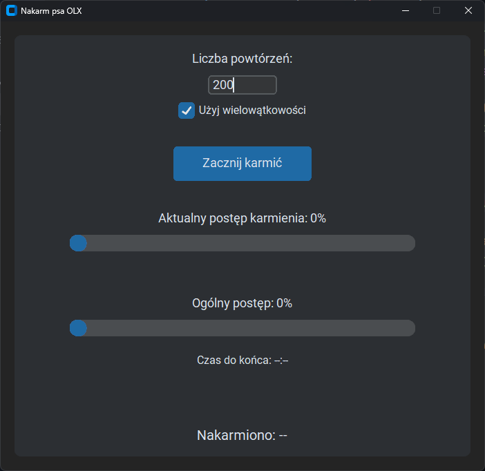

# Nakarm Psa OLX

## Opis programu

**Nakarm Psa OLX** to aplikacja, która umożliwia automatyczne karmienie wszystkich zwierząt dostępnych na stronie akcji "Nakarm Psa" od OLX. Program pobiera listę zwierząt, pozwala na ustawienie liczby powtórzeń karmienia oraz wspiera wielowątkowość, co znacząco przyspiesza cały proces, choć wiąże się to z większym zużyciem zasobów.

### Funkcje programu:

- Karmienie wszystkich dostępnych zwierząt, na które można oddać głos.
- Możliwość ustawienia liczby powtórzeń karmienia dla każdego zwierzęcia.
- Wsparcie dla wielowątkowości, co pozwala na szybsze wykonanie procesu.
- Wyświetlanie pasków postępu:
  - **Dla pojedynczego procesu karmienia wszystkich zwierząt.**
  - **Dla ogólnego postępu całego procesu.**
- Szacowany czas do zakończenia działania programu.

## Uruchamianie programu

Cały kod programu znajduje się w pliku `nakarm-psa.py`. Istnieją dwie możliwości uruchomienia programu:

### 1. Gotowy plik wykonywalny

Program można uruchomić, korzystając z przygotowanego pliku wykonywalnego `nakarm-psa.exe`.

**Ekran aplikacji:**



### 2. Uruchamianie kodu źródłowego

Aby uruchomić program z kodu źródłowego, należy:

1. Upewnić się, że na komputerze zainstalowany jest Python (w wersji co najmniej 3.7).
2. Zainstalować wymagane biblioteki, wpisując w terminalu:
   ```bash
   pip install -r requirements.txt
   ```
3. Uruchomić program za pomocą komendy:
   ```bash
   python nakarm-psa.py
   ```

## Szczegóły działania

1. Program rozpoczyna działanie od pobrania listy dostępnych zwierząt do nakarmienia.
2. Dla każdego zwierzęcia wykonuje żądanie do serwera OLX w celu oddania głosu.
3. Postęp procesu można śledzić na paskach postępu:
   - **Postęp pojedynczego karmienia** – pokazuje, ile procent karmienia wszystkich zwierząt zostało zakończone w danej iteracji.
   - **Ogólny postęp** – przedstawia procentowo zaawansowanie całego procesu.
4. Przy włączonej wielowątkowości program równocześnie karmi kilka zwierząt, co przyspiesza działanie, ale zwiększa zużycie zasobów systemowych.
5. Wyświetlany jest przewidywany czas do zakończenia działania programu.

## Uwagi

W przypadku błędów, takich jak przeciążenie serwera (HTTP 429), program automatycznie próbuje ponownie wysłać żądanie, stosując mechanizm tzw. `exponential backoff`.

Dziękujemy za korzystanie z aplikacji i życzymy udanego karmienia zwierzaków!
